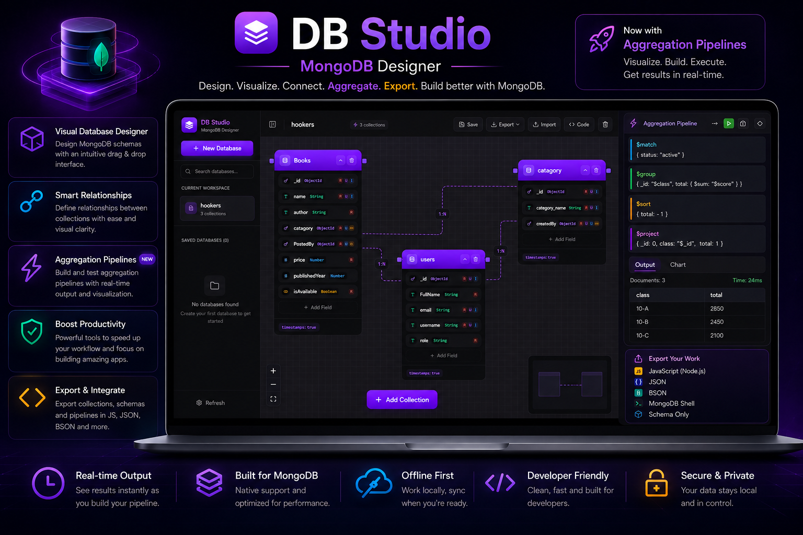

# MongoDB Schema Designer

<p align="center">


</p>

> 🚀 A modern visual MongoDB schema designer for building collections, relationships, aggregation pipelines, and production-ready Mongoose models—all with real-time code generation.


## 🌟 Overview

MongoDB Schema Designer is a fully frontend, visual database modeling web app built with React and Vite. It helps developers and teams design MongoDB collections, configure fields, define relationships, and export Mongoose schemas with ease.




## 🚀 What You Can Do

- Design MongoDB collections visually using a drag-and-drop canvas
- Define fields with types, validations, defaults, enums, indexes, and ObjectId references
- Create one-to-one, one-to-many, and many-to-many relationships between collections
- Build aggregation pipelines with stage tracking and field propagation
- Export project JSON or generate production-ready Mongoose schema files
- Store work locally with IndexedDB, no server needed


## ✨ Key Features

### 🧩 Visual Schema Modeling
- Interactive canvas with drag, pan, zoom, and snap
- Collection nodes for schema structure and metadata
- Relationship edges for easy reference management

### 🧱 Field & Schema Options
- Support for common MongoDB field types
- Field-level settings: required, unique, indexed, default values
- Validation rules: min/max, string length, regex patterns
- Enum and nested object support

### 🔗 Relationships
- Visual relationship creation between collections
- Relationship types: 1:1, 1:N, N:M
- Click edge labels to switch relationship modes

### 📊 Aggregation Pipeline Builder
- Add and reorder pipeline stages visually
- Supported stages: `$match`, `$group`, `$project`, `$sort`, `$limit`, `$skip`, `$unwind`, `$lookup`, `$addFields`, `$count`
- Automatic schema tracking across stages
- Stage badges show generated field counts

### 🧾 Export & Code Generation
- Preview syntax-highlighted Mongoose schema output
- Export generated schemas as ZIP files
- Export and import project JSON for persistence


## 🛠️ Tech Stack

- React 18 + Vite
- Zustand for state management
- React Flow (`@xyflow/react`) for the canvas experience
- Tailwind CSS for UI styling
- `idb` for IndexedDB persistence
- `prism-react-renderer` for code highlighting
- `jszip` + `file-saver` for exports


## ▶️ Getting Started

### 1. Install dependencies

```bash
npm install
```

### 2. Start the development server

```bash
npm run dev
```

Open the app at `http://localhost:5000`


## 🧭 Usage Tips

1. Add a new collection using the toolbar
2. Rename collections by double-clicking the title
3. Add fields and configure type, validation, and default values
4. Connect fields using relationship handles
5. Toggle relationship cardinality by clicking edge labels
6. Generate Mongoose schemas from the code panel
7. Export your design as JSON or ZIP


## 💡 Why This Project

- Fully client-side: no backend dependency required
- Designed for MongoDB and Mongoose workflows
- Fast prototyping for MERN / MEAN architectures
- Ideal for teaching schema design and relationship modeling


## 📌 Use Cases

- MongoDB schema planning
- Collection relationship design
- Mongoose schema generation
- Teaching database modeling
- Rapid frontend-first prototyping


## 🧪 Package Info

```json
{
  "name": "mongo-diagram-designer",
  "version": "1.0.0",
  "type": "module"
}
```


## 📄 License
MIT License


## 🤝 Contributing

Contributions are welcome! Feel free to open issues, share improvements, or create a pull request.


